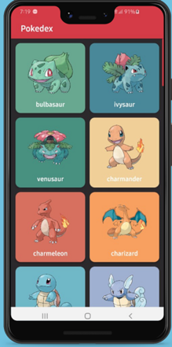
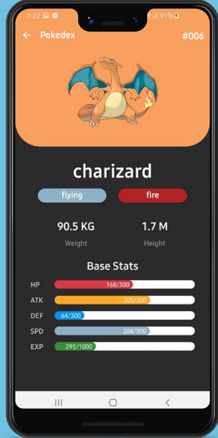

# やること
- Android Basic With Jetpack Compose の学習を通して学んだことを復習する
- API のサンプルを探していて、Android Dagashi で見つけた pokedex を Compose で書き換えてみる

# 画面仕様
| 一覧画面 | 詳細画面 |
|----|----|
|    |    |

# ライブラリ
- Jetpack
  - Ui layer
    - Jetpack Compose
      - Lifecycle
      - ViewModel
    - Coil (AsyncImage)
  - Database layer
    - Room
- Architecture
  - MVVM (Like clean Architecture)
- API 
  - Api Client
    - Retrofit
    - OkHttp
  - Json Converter
    - Kotlin.serialization
- Logger
  - Timber

とりあえずこんなもんで良さそうかな

# どういう順序で作る？
まずは API 通信からやっていく
せっかく、Codelab で API 通信を叩く時のコミット順序を[まとめておいたのでそれを参考](https://github.com/hiroki-horiguchi-dev/AndroidBasicWithCompose/blob/dev/app/src/main/java/com/example/compose/unit5/showImageFromInternet/bookshelf/review/memo.md)にやってみよう！
1. モデルの作成 (core-model)
2. Api サービスの作成 (core-network)
3. Repository の作成 (core-data)
4. Container の作成 (Application クラスをどこに作るかね。。パクリ元の pokedex にはないけど、、うーん。。)
5. ViewModel, UI の作成 (app)
6. UI テーマの設定(ぱっと見が黒っぽいのでそんな感じのテーマにする)
7. アプリアイコンの設定(これはできればでいいや)
8. now in android を参考にそれぞれのレイヤーでモジュール作って完全に独立させたい
   1. ディープリンク捌くのむずい問題があったらしいが、now in android のソースコード見た感じだと全然捌けていそうなので問題なさそうかな
   2. composable ( deeplinks ) で捌けているかんじかな

# この後の展望
- [Now in Android](https://github.com/android/nowinandroid) を真似して作ってみる
  - 知りたいこと
    - ボトムナビゲーションを含む一般的なアプリの外観、遷移を Jetpack Compose でどう作るか？のサンプルを知りたい
